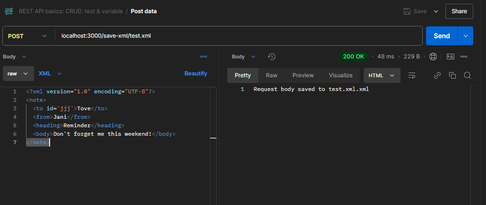
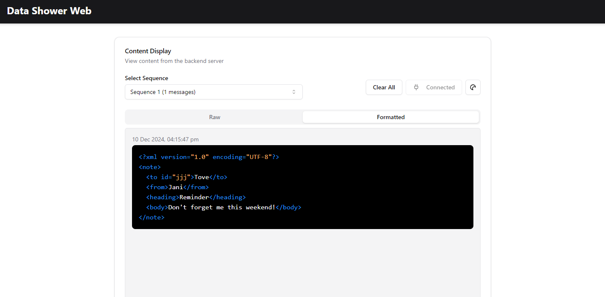

## build web front end 

1. `cd data-shower-web`
    1. `npm install`
    2. `npm run build`
    3. copy dist folder to data-shower-server(bun)
2. `cd ../data-shower-server(bun)`
    1. add self-sign X509 cert to /certs/
    2. `docker-compose up`

## Usage
Mainly used for debug and tracking a sequence of requests and responses

1. send xml request

2. get it from the web

## REST API
### xml
1. `http://localhost:3000/save-xml/{file name}`
1. `https://localhost:3443/save-xml/{file name}`
### json
1. `http://localhost:3000/save-json/{file name}`
1. `https://localhost:3443/save-json/{file name}`